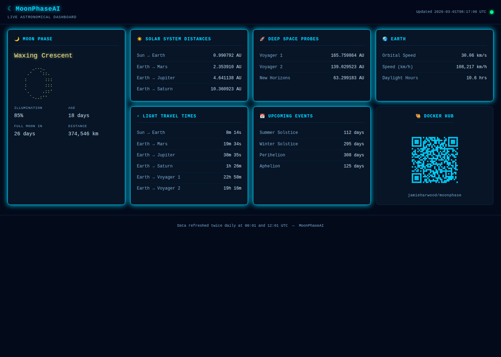

# MoonPhaseAI

MoonPhaseAI is a Java Spring Boot application that calculates astronomical data including moon phases, planetary distances, light travel times, and solstice timings. It runs as a scheduled background task, pushes updates to an [Awtrix](https://awtrixdocs.blueforcer.de/) device, and optionally serves a live web dashboard accessible in any browser.

## Features

The application performs the following calculations on a configurable schedule (default: 00:01 and 12:01 UTC daily):

### Moon Phase
- Calculates the current moon phase, age (days since new moon), and illumination percentage.
- Displays an ASCII art representation of the moon in the logs.
- Verifies the calculated phase against the Claude AI API and corrects it if there is a mismatch.
- Sends the moon phase name, illumination %, and days until next full moon to the Awtrix device.

### Solar System Distances
- **Sun–Earth**: Current distance in AU with annual min/max comparison.
- **Earth–Mars**: Current distance in AU with annual min/max comparison.
- **Earth–Jupiter**: Current distance in AU with annual min/max comparison.
- **Earth–Saturn**: Current distance in AU with annual min/max comparison.
- **Moon**: Current distance in km with annual min/max comparison.

### Deep Space Probes
- **Voyager 1 & 2**: Estimated distance from Earth in AU.
- **New Horizons**: Estimated distance from Earth in AU.

### Light Travel Times
- Calculated for: Sun→Earth, Earth→Mars, Earth→Jupiter, Earth→Saturn, Earth→Voyager 1, Earth→Voyager 2.

### Earth
- Current orbital speed in km/s and km/h.
- Daylight hours for a configurable latitude (default: 51.4769° N, Greenwich).

### Upcoming Events
- Days until next Summer Solstice, Winter Solstice, Perihelion, and Aphelion.

### Awtrix Integration
- Checks connectivity to the Awtrix device at startup.
- Pushes all metrics to the `/api/custom` endpoint on the configured Awtrix server.

---

## Web Dashboard

MoonPhaseAI includes an optional live web dashboard that displays all computed metrics in a browser, updated in real time via Server-Sent Events (SSE) whenever the scheduled calculation cycle completes.



The dashboard is **enabled by default** and accessible at `http://localhost:8080/` (or the configured port).

### Installing as an app

The dashboard is a Progressive Web App (PWA). Once the page has loaded:

- **Chrome / Edge (desktop):** an **⇩ Install App** button appears in the header — click it to install as a standalone desktop app.
- **Chrome (Android):** the install button appears in the header, or use the browser's "Add to Home Screen" option.
- **Safari (iOS/macOS):** tap Share → "Add to Home Screen" — uses the dedicated 180×180 touch icon.

The installed app uses a network-first service worker so live data is never stale. All static assets are cached for offline resilience.

> **Note:** The PWA install prompt requires the site to be served over **HTTPS**. On `localhost` it works without TLS for local testing. For production, place the container behind a reverse proxy (e.g. nginx + Let's Encrypt).

### Disabling the dashboard (headless mode)

To run without a web server (e.g. on a resource-constrained device), set the following environment variable:

```
SPRING_MAIN_WEB-APPLICATION-TYPE=none
```

---

## Configuration

All configuration is via environment variables:

| Variable | Default | Description |
|---|---|---|
| `AWTRIXHOSTNAME` | `http://moonclock.local` | Base URL of the Awtrix device |
| `LATITUDE` | `51.4769` | Latitude in decimal degrees (positive = North) for daylight calculations |
| `CRON_SCHEDULE` | `0 1 0,12 * * *` | Spring cron expression for the update schedule |
| `CLAUDE_API_KEY` | _(none)_ | Anthropic API key for moon phase verification (optional) |
| `CLAUDE_MODEL` | `claude-sonnet-4-6` | Claude model ID to use for moon phase verification |
| `SERVER_PORT` | `8080` | Port the web dashboard listens on |
| `SPRING_MAIN_WEB-APPLICATION-TYPE` | `servlet` | Set to `none` to disable the web dashboard |

---

## Running with Docker

The recommended way to run MoonPhaseAI is via Docker. Create an `env` file (do not commit to version control):

```
AWTRIXHOSTNAME=http://your-awtrix-device.local
LATITUDE=53.4808
CLAUDE_API_KEY=your-api-key-here
```

Then start the container:

```bash
docker compose up -d
```

To change the dashboard port, edit `SERVER_PORT` in `docker-compose.yml`:

```yaml
- SERVER_PORT=9090
```

Or pull the latest image directly from Docker Hub:

```bash
docker pull jamieharwood/moonphase:latest
```

---

## Building

```bash
./gradlew bootJar
```

Or build the Docker image:

```bash
docker build -t jamieharwood/moonphase:latest .
```

---

## Awtrix Apps

The following named apps are pushed to the Awtrix device:

| App Name | Content | Icon |
|---|---|---|
| `moonphase` | Current phase name | Phase icon |
| `moonillumination` | Illumination % | Phase icon |
| `fullmoon` | Days until next full moon | `FullMoon` |
| `marsDistanceAu` | Earth–Mars distance in AU | `MARS` |
| `jupiterDistanceAu` | Earth–Jupiter distance in AU | `JUPITER` |
| `saturnDistanceAu` | Earth–Saturn distance in AU | `SATURN` |
| `voyager1` | Voyager 1 distance in AU | `VOYAGER` |
| `voyager2` | Voyager 2 distance in AU | `VOYAGER` |
| `newhorizons` | New Horizons distance in AU | `NEWHORIZONS` |
| `summersolstice` | Days until summer solstice | `SUMMER` |
| `wintersolstice` | Days until winter solstice | `WINTER` |
| `CurrentDayLength` | Current daylight hours | `DAYLENGTH` |
| `earthSpeed` | Earth orbital speed in km/s | `EARTH` |
| `moonDistance` | Moon distance in km | `MOON` |
| `perihelion` | Days until perihelion | `PERIHELION` |
| `aphelion` | Days until aphelion | `PERIHELION` |
| `lightMars` | Light travel time to Mars | `LIGHT` |
| `lightJupiter` | Light travel time to Jupiter | `LIGHT` |
